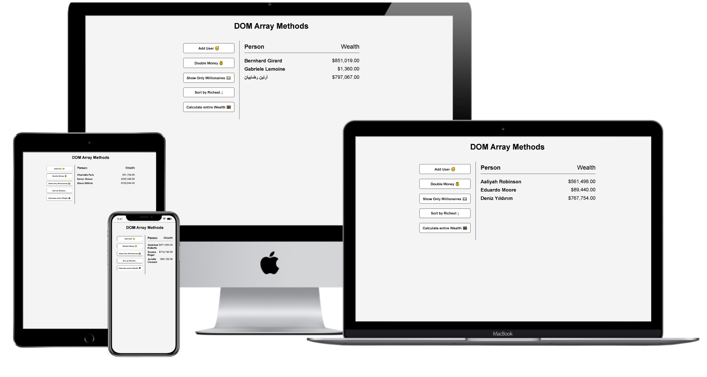

<h1 align="center">
 
  
   
     
  JavaScript - Dom Array Methods
   
</h1>

<h3 align="center">Interactive Front End Development</h3>

## DOM Array Methods

forEach, map, sort, filter, reduce

## Project Specifications

- Fetch random users from the [randomuser.me](https://randomuser.me) API
- Use forEach() to loop and output user/wealth
- Use map() to double wealth
- Use filter() to filter only millionaires
- Use sort() to sort by wealth
- Use reduce() to add all wealth
